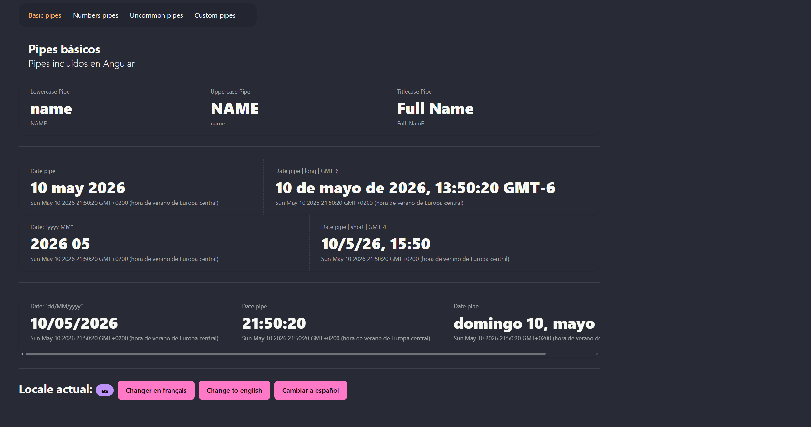

Español | [English](README.md)

# Pipes-app

[](https://angular.dev/)
[](https://www.typescriptlang.org/)
[](https://tailwindcss.com/)
[](https://daisyui.com/)



<br>

Este es un proyecto de **aprendizaje y práctica** creado con Angular como parte del **curso de Angular de DevTalles (Fernando Herrera)** para explorar y comprender cómo funcionan los **pipes integrados y personalizados**.
La aplicación muestra diferentes ejemplos de pipes, como **transformaciones de texto, formato de fechas y pipes personalizados**, utilizando componentes de UI reutilizables y datasets tipados.  
El objetivo de este proyecto es practicar conceptos de Angular como:

- Uso de pipes integrados
- Creación de pipes personalizados
- Formateo de datos en plantillas
- Organización de componentes reutilizables
- Uso de datasets tipados en aplicaciones Angular

<br>

## Tecnologías

- Angular 21
- TypeScript
- Tailwind CSS
- daisyUI

<br>

## Instalación

1. Clonar el repositorio:
   ```bash
   git clone https://github.com/Antonio-Borrero/pipes-app-angular.git
   ```
   
2. Instalar dependencias:
   ```bash
   npm install
   ```
   
3. Ejecutar el Servidor de desarrollo:
   ```bash
   ng serve
   ```
   
4. Abrir en el navegador:
   - Ir a http://localhost:4200/.
   - La aplicación se recargará automáticamente al modificar cualquier archivo

<br>

## Funcionalidades

- Pipes integrados de Angular
  - `uppercase`
  - `lowercase`
  - `titlecase`
  - `date`
  - `number`
  - `currency`
  - `i18nSelect`
  - `i18nPlural`
  - `json`
  - `keyValue`
  - `slice`
- Pipes personalizados
   - `Toggle case pipe`
   - `Otros pipes personalizados`
- Ejemplos en tablas utilizando datasets tipados
- Componente reutilizable de tarjeta (card)
- Navegación con navbar responsiva
- Estilos con TailwindCSS y DaisyUI

<br>

## Aprendizajes

- Cómo funcionan los pipes de Angular
- Creación de pipes personalizados
- Formateo de datos en plantillas
- Organización de componentes reutilizables
- Uso de datasets tipados con pipes

<br>

## Estructura del proyecto

```bash
- src/
 ├───app
    ├───components             # Componentes de UI reutilizables
    │   ├───card
    │   └───navbar
    ├───data                   # Datasets de ejemplo usados en demostraciones de pipes
    ├───interfaces             # Interfaces y tipos en TypeScript
    ├───pages                  # Páginas de la aplicación
    │   ├───basic-page
    │   ├───custom-page
    │   ├───numbers-page
    │   └───uncommon-page
    ├───pipes                  # Pipes personalizados de Angular
    └───services               # Servicios de la aplicación
```

<br>

## Producción
```bash
ng build
```
   
